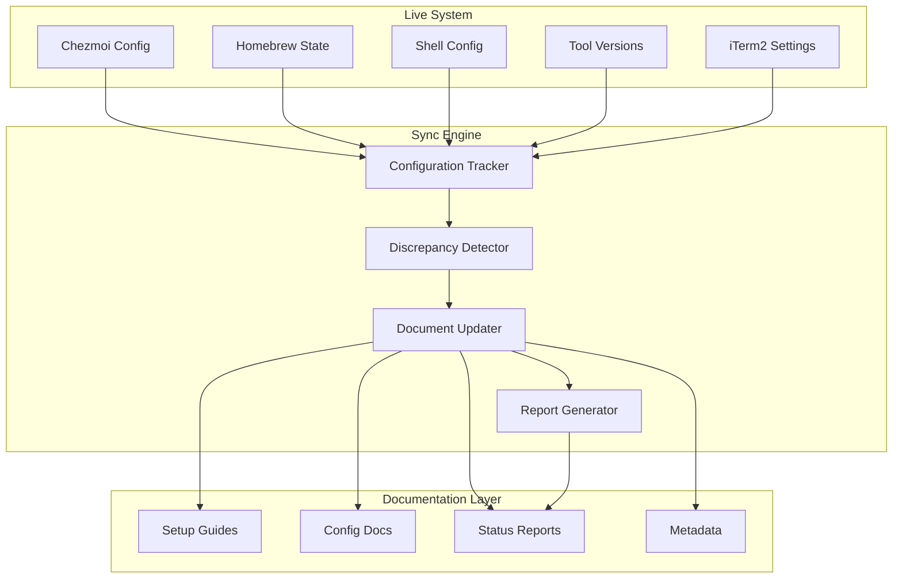

# Documentation Synchronization Architecture

> **Holistic, context-aware documentation system that maintains perfect alignment with system configuration**
>
> Version: 2.0.0 | Last Updated: 2025-09-26 | Status: Active

## 🎯 System Overview

This repository implements a sophisticated documentation synchronization architecture that:
1. **Understands** the complete system configuration context
2. **Monitors** changes across all configuration layers
3. **Validates** consistency between documentation and reality
4. **Updates** documentation automatically when discrepancies are detected
5. **Reports** on system health and compliance

## 🔄 Synchronization Flow



## 📊 Key Components

### 1. Configuration Sources

The system monitors multiple configuration sources:

| Source | Location | Purpose | Update Frequency |
|--------|----------|---------|------------------|
| **Chezmoi** | `~/.local/share/chezmoi/` | Dotfile templates | On change |
| **Dotfiles** | `~/workspace/dotfiles/` | Active configurations | On change |
| **Homebrew** | `/opt/homebrew/` | Package management | Daily |
| **Config Files** | `~/.config/` | Application settings | On change |
| **System State** | Various | OS/hardware info | Weekly |

### 2. Documentation Layers

Documentation is organized into synchronized layers:

```
Documentation Repository
├── 01-setup/           # Installation guides (synced with tool presence)
├── 02-configuration/   # Config guides (synced with actual configs)
├── 03-automation/      # Scripts that perform the sync
├── 04-policies/        # Rules validated against system
├── 05-reference/       # Supporting docs (manually maintained)
├── 06-templates/       # Templates (synced from chezmoi)
├── 07-reports/         # Auto-generated status reports
└── .meta/             # Metadata and sync state
```

### 3. Synchronization Scripts

#### Primary Sync Engine
**File**: `03-automation/scripts/doc-sync-engine.py`
- **Purpose**: Holistic system analysis and documentation update
- **Features**:
  - Complete context capture
  - Discrepancy detection
  - Automatic documentation updates
  - Change watching capability

#### Shell-Based Sync
**File**: `03-automation/scripts/sync-system-state.sh`
- **Purpose**: Quick state capture and report generation
- **Use Case**: CI/CD pipelines, quick checks

#### Validation Script
**File**: `04-policies/validate-policy.py`
- **Purpose**: Validate system compliance with policies
- **Integration**: Called by sync engine for compliance reports

## 🔍 Context Awareness

### System Context Object

The sync engine maintains a complete system context:

```python
@dataclass
class SystemContext:
    timestamp: str
    os_info: Dict[str, str]          # OS version, arch, hardware
    installed_tools: Dict[str, str]   # Tool → version mapping
    active_configs: Dict[str, Any]    # Config file states
    chezmoi_state: Dict[str, Any]     # Managed files, changes
    documentation_state: Dict[str, Any] # Doc metadata, currency
    discrepancies: List[Dict[str, Any]] # Detected issues
```

### Discrepancy Detection

The system detects various types of discrepancies:

| Type | Description | Severity | Auto-Fix |
|------|-------------|----------|----------|
| `missing_tool` | Documented but not installed | High | No |
| `version_mismatch` | Version differs from docs | Medium | Yes |
| `config_drift` | Config changed without doc update | Medium | Yes |
| `stale_documentation` | Doc > 30 days old | Low | Flag |
| `chezmoi_changes` | Uncommitted chezmoi changes | Medium | No |

## 📝 Documentation Metadata

Every document includes frontmatter for tracking:

```yaml
---
title: Document Title
category: setup|configuration|automation|policy|reference|template|report
component: homebrew|chezmoi|fish|iterm2|etc
status: draft|active|deprecated
version: 1.0.0
last_updated: 2025-09-26
dependencies:
  - doc: path/to/dependency.md
    type: required|optional
tags: [macos, terminal, productivity]
sync:
  source: ~/.config/component/config  # Source file to sync from
  frequency: on_change|daily|weekly
  auto_update: true|false
---
```

## 🚀 Automation Workflows

### 1. Manual Sync
```bash
# Full system sync with reports
python 03-automation/scripts/doc-sync-engine.py

# Quick state capture
./03-automation/scripts/sync-system-state.sh
```

### 2. Automated Sync (Git Hooks)
```bash
# Pre-commit: Validate documentation
.git/hooks/pre-commit → validate-docs.sh

# Post-merge: Update from upstream
.git/hooks/post-merge → sync-from-live.sh
```

### 3. Scheduled Sync (Cron/LaunchAgent)
```xml
<!-- ~/Library/LaunchAgents/com.system.docsync.plist -->
<key>ProgramArguments</key>
<array>
    <string>python3</string>
    <string>~/Development/personal/system-setup-update/03-automation/scripts/doc-sync-engine.py</string>
</array>
<key>StartInterval</key>
<integer>3600</integer> <!-- Every hour -->
```

### 4. CI/CD Integration (GitHub Actions)
```yaml
name: Documentation Sync
on:
  schedule:
    - cron: '0 */6 * * *'  # Every 6 hours
  workflow_dispatch:

jobs:
  sync:
    runs-on: macos-latest
    steps:
      - uses: actions/checkout@v3
      - run: python 03-automation/scripts/doc-sync-engine.py
      - uses: peter-evans/create-pull-request@v5
        with:
          title: "docs: sync with system state"
```

## 📊 Reports Generated

### Status Reports
- `07-reports/status/implementation-status.md` - Phase completion tracking
- `07-reports/status/tool-versions.md` - Current tool versions
- `07-reports/status/sync-summary.md` - Latest sync results
- `07-reports/status/system-context.json` - Complete system snapshot

### Compliance Reports
- `07-reports/status/compliance-check.txt` - Policy validation results
- `07-reports/status/discrepancies.json` - Detected issues

### Historical Reports
- `07-reports/history/YYYY-MM-DD/` - Archived daily reports
- `07-reports/metrics/performance.json` - Sync performance metrics

## 🔐 Security Considerations

1. **No Secrets in Documentation**
   - Sync engine excludes sensitive files
   - Checksums used instead of content for private configs

2. **Read-Only by Default**
   - Documentation updates only
   - System changes require explicit confirmation

3. **Audit Trail**
   - All sync operations logged
   - Change history maintained in git

## 🎯 Integration Points

### With Chezmoi
```bash
# Export current state to documentation
chezmoi data → 07-reports/status/chezmoi-data.json

# Template synchronization
~/.local/share/chezmoi/ → 06-templates/chezmoi/
```

### With System Configuration
```bash
# Configuration file monitoring
~/.config/*/ → 02-configuration/*/

# Tool version tracking
mise list → 07-reports/status/tool-versions.md
```

### With Development Workflow
```bash
# Pre-setup validation
python validate-requirements.py

# Post-setup verification
./03-automation/scripts/validate.sh
```

## 📈 Metrics and Monitoring

### Documentation Health Metrics
- **Coverage**: % of configs with documentation
- **Currency**: % of docs updated < 30 days
- **Accuracy**: % of docs matching reality
- **Completeness**: % of docs with metadata

### System Health Indicators
- Installed vs documented tools
- Configuration drift score
- Compliance percentage
- Discrepancy count by severity

## 🔄 Continuous Improvement

The system continuously improves through:

1. **Feedback Loops**
   - Discrepancy detection → Documentation update
   - User reports → Validation enhancement

2. **Version Tracking**
   - Git history for all changes
   - Semantic versioning for major updates

3. **Context Learning**
   - Pattern recognition for common changes
   - Automatic categorization of new configs

## 🚦 Status Dashboard

Current system status is always available:

```bash
# View current status
cat 07-reports/status/sync-summary.md

# Check last sync
cat .meta/sync-info.json

# Validate system
python 04-policies/validate-policy.py
```

## 🎉 Benefits

1. **Always Accurate**: Documentation reflects actual system state
2. **Context Aware**: Understands relationships between components
3. **Proactive**: Detects and reports discrepancies automatically
4. **Comprehensive**: Covers all aspects of system configuration
5. **Maintainable**: Self-documenting and self-validating

---

This architecture ensures that documentation is not just a static artifact but a living, breathing representation of the actual system configuration. It eliminates the traditional problem of documentation drift by making the documentation system aware of and responsive to the actual configuration state.