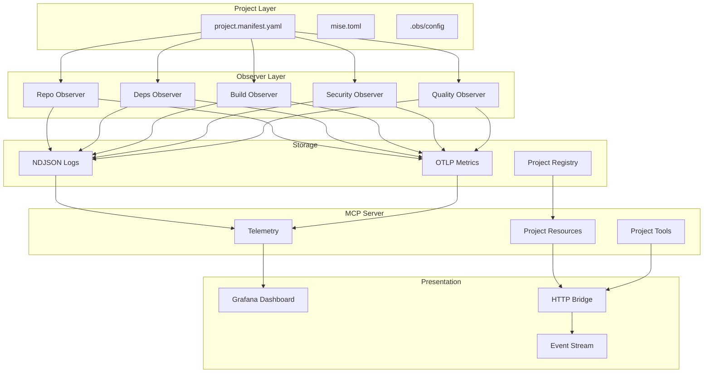

# Project Observability Platform Implementation Plan
**Created**: 2025-09-28
**Type**: Technical Implementation
**Status**: Active Development
**Timeline**: 6-day sprint

## Executive Summary
Transform the existing DevOps MCP server and system configuration into a continuous, project-aware observability platform with typed contracts, automated observers, and real-time dashboards.

## Architecture Overview



## Phase 1: Foundation (Day 1-2)

### 1.1 Project Manifest Schema
Create typed, validatable project metadata structure.

**Location**: `~/Development/personal/devops-mcp/schema/`

```typescript
// project.manifest.schema.ts
import { z } from 'zod';

export const ProjectManifestSchema = z.object({
  apiVersion: z.literal('devops.v1'),
  project: z.object({
    id: z.string().regex(/^[a-z]+:[a-z0-9-]+\/[a-z0-9-]+$/),
    name: z.string().min(1).max(100),
    org: z.string().min(1).max(50),
    tier: z.enum(['prod', 'staging', 'sandbox', 'dev']),
    kind: z.enum(['app', 'lib', 'ml', 'data', 'infra', 'docs']),
    owners: z.array(z.string().email()).min(1)
  }),
  runtime: z.object({
    language: z.enum(['node', 'python', 'go', 'rust', 'java', 'multi']),
    miseProfiles: z.array(z.string()).optional()
  }),
  repo: z.object({
    url: z.string().url(),
    defaultBranch: z.string().default('main'),
    protectedBranches: z.array(z.string()).optional(),
    signedCommitsRequired: z.boolean().default(false)
  }),
  quality: z.object({
    minCoverage: z.number().min(0).max(1).default(0.8),
    linters: z.array(z.string()).optional(),
    licensesAllow: z.array(z.string()).optional(),
    sbom: z.boolean().default(false)
  }),
  observability: z.object({
    slo: z.object({
      ciSuccessRate: z.string().regex(/^[><=]+[\d.]+$/),
      p95LocalBuildSec: z.string().regex(/^[><=]+[\d.]+$/)
    }).optional(),
    metrics: z.object({
      enableBusiness: z.boolean().default(false)
    }).optional(),
    alerts: z.object({
      channel: z.string().optional()
    }).optional()
  }),
  dependencies: z.object({
    packageManagers: z.array(z.enum(['npm', 'pip', 'cargo', 'go', 'mix'])),
    updatePolicy: z.enum(['daily', 'weekly', 'monthly']).default('weekly')
  }).optional(),
  security: z.object({
    secretRefs: z.array(z.string().startsWith('secret://gopass/')).optional(),
    owaspLevel: z.enum(['L1', 'L2', 'L3']).optional()
  }).optional(),
  dashboard: z.object({
    panels: z.array(z.string()).default(['buildHealth', 'coverage', 'deps'])
  }).optional()
});

export type ProjectManifest = z.infer<typeof ProjectManifestSchema>;
```

### 1.2 Observer Output Contract

```typescript
// observer.contract.schema.ts
export const ObserverOutputSchema = z.object({
  apiVersion: z.literal('obs.v1'),
  run_id: z.string().uuid(),
  timestamp: z.string().datetime(),
  project_id: z.string(),
  observer: z.enum(['repo', 'deps', 'build', 'quality', 'security', 'sbom']),
  summary: z.string().max(200),
  metrics: z.record(z.union([z.number(), z.string()])),
  status: z.enum(['ok', 'warn', 'fail']),
  links: z.object({
    repo: z.string().url().optional(),
    ci: z.string().url().optional(),
    trace: z.string().url().optional()
  }).optional(),
  audit_id: z.string().uuid().optional(),
  trace_id: z.string().optional(),
  span_id: z.string().optional()
});

export type ObserverOutput = z.infer<typeof ObserverOutputSchema>;
```

### 1.3 Project Discovery Implementation

```typescript
// src/tools/project-discover.ts
import { readdirSync, readFileSync, lstatSync, realpathSync } from 'fs';
import { join, isAbsolute } from 'path';
import { ProjectManifestSchema } from '../schema/project.manifest.schema';
import * as yaml from 'js-yaml';

interface DiscoveryOptions {
  roots?: string[];
  maxDepth?: number;
  followSymlinks?: boolean;
  strict?: boolean;
}

export class ProjectDiscovery {
  private allowedRoots = [
    '~/Development/personal',
    '~/Development/work',
    '~/Development/business',
    '~/workspace/projects'
  ];

  private registry: Map<string, ProjectManifest> = new Map();

  async discover(options: DiscoveryOptions = {}): Promise<ProjectRegistry> {
    const roots = options.roots || this.allowedRoots;
    const maxDepth = options.maxDepth || 3;

    for (const root of roots) {
      await this.scanDirectory(
        this.expandPath(root),
        0,
        maxDepth,
        options
      );
    }

    return this.saveRegistry();
  }

  private async scanDirectory(
    path: string,
    depth: number,
    maxDepth: number,
    options: DiscoveryOptions
  ): Promise<void> {
    if (depth > maxDepth) return;

    // Security: validate path is within allowed roots
    if (!this.isPathAllowed(path)) {
      throw new Error(`Path not allowed: ${path}`);
    }

    try {
      const entries = readdirSync(path);

      for (const entry of entries) {
        const fullPath = join(path, entry);
        const stat = lstatSync(fullPath);

        if (stat.isSymbolicLink() && !options.followSymlinks) {
          continue;
        }

        if (stat.isDirectory()) {
          // Check for manifest
          const manifestPath = join(fullPath, 'project.manifest.yaml');
          if (existsSync(manifestPath)) {
            await this.validateAndRegister(manifestPath, options.strict);
          }

          // Recurse
          await this.scanDirectory(fullPath, depth + 1, maxDepth, options);
        }
      }
    } catch (error) {
      // Log but continue scanning
      console.error(`Discovery error in ${path}:`, error);
    }
  }

  private async validateAndRegister(
    manifestPath: string,
    strict: boolean = false
  ): Promise<void> {
    try {
      const content = readFileSync(manifestPath, 'utf-8');
      const parsed = yaml.load(content);

      const result = ProjectManifestSchema.safeParse(parsed);

      if (result.success) {
        this.registry.set(result.data.project.id, result.data);
      } else if (strict) {
        throw new Error(`Invalid manifest at ${manifestPath}: ${result.error}`);
      }
    } catch (error) {
      console.error(`Failed to register ${manifestPath}:`, error);
    }
  }
}
```

## Phase 2: Core Observers (Day 3-4)

### 2.1 Repo Observer

```typescript
// src/observers/repo.observer.ts
import { exec } from 'child_process';
import { promisify } from 'util';
import { ObserverOutput } from '../schema/observer.contract.schema';
import { v7 as uuidv7 } from 'uuid';

const execAsync = promisify(exec);

export class RepoObserver {
  async observe(projectPath: string, projectId: string): Promise<ObserverOutput> {
    const startTime = Date.now();
    const runId = uuidv7();

    try {
      // Get repo status
      const status = await this.getRepoStatus(projectPath);
      const branch = await this.getCurrentBranch(projectPath);
      const ahead = await this.getAheadBehind(projectPath);
      const dirty = await this.isDirty(projectPath);
      const signed = await this.isHeadSigned(projectPath);

      const metrics = {
        ahead: ahead.ahead,
        behind: ahead.behind,
        dirty_files: dirty.count,
        untracked: dirty.untracked,
        signed_head: signed ? 1 : 0,
        latency_ms: Date.now() - startTime
      };

      const status = this.determineStatus(metrics);

      return {
        apiVersion: 'obs.v1',
        run_id: runId,
        timestamp: new Date().toISOString(),
        project_id: projectId,
        observer: 'repo',
        summary: `Branch: ${branch}, ${ahead.ahead}↑ ${ahead.behind}↓, ${dirty.count} dirty`,
        metrics,
        status,
        links: {
          repo: await this.getRepoUrl(projectPath)
        }
      };
    } catch (error) {
      return this.errorOutput(runId, projectId, error);
    }
  }

  private async getRepoStatus(path: string): Promise<any> {
    const { stdout } = await execAsync(
      'git status --porcelain=v2 -b',
      { cwd: path, timeout: 5000 }
    );
    return this.parseGitStatus(stdout);
  }

  private async getCurrentBranch(path: string): Promise<string> {
    const { stdout } = await execAsync(
      'git branch --show-current',
      { cwd: path, timeout: 1000 }
    );
    return stdout.trim();
  }

  private determineStatus(metrics: any): 'ok' | 'warn' | 'fail' {
    if (metrics.behind > 10) return 'fail';
    if (metrics.dirty_files > 20) return 'fail';
    if (metrics.behind > 0 || metrics.dirty_files > 0) return 'warn';
    return 'ok';
  }
}
```

### 2.2 Dependencies Observer

```typescript
// src/observers/deps.observer.ts
export class DepsObserver {
  async observe(projectPath: string, projectId: string, manifest: ProjectManifest): Promise<ObserverOutput> {
    const runId = uuidv7();
    const startTime = Date.now();

    try {
      const results = await Promise.all(
        manifest.dependencies?.packageManagers.map(pm =>
          this.checkPackageManager(projectPath, pm)
        ) || []
      );

      const aggregated = this.aggregateResults(results);

      return {
        apiVersion: 'obs.v1',
        run_id: runId,
        timestamp: new Date().toISOString(),
        project_id: projectId,
        observer: 'deps',
        summary: `${aggregated.outdated} outdated, ${aggregated.vulnerable} vulnerable`,
        metrics: {
          outdated: aggregated.outdated,
          outdated_major: aggregated.outdatedMajor,
          vulnerable: aggregated.vulnerable,
          vuln_critical: aggregated.vulnCritical,
          latency_ms: Date.now() - startTime
        },
        status: this.determineStatus(aggregated)
      };
    } catch (error) {
      return this.errorOutput(runId, projectId, error);
    }
  }

  private async checkPackageManager(path: string, pm: string): Promise<DepsResult> {
    switch (pm) {
      case 'npm':
        return this.checkNpm(path);
      case 'pip':
        return this.checkPip(path);
      case 'cargo':
        return this.checkCargo(path);
      default:
        throw new Error(`Unsupported package manager: ${pm}`);
    }
  }

  private async checkNpm(path: string): Promise<DepsResult> {
    const outdated = await execAsync(
      'npm outdated --json',
      { cwd: path, timeout: 30000 }
    ).catch(e => ({ stdout: '{}' })); // npm outdated exits non-zero

    const audit = await execAsync(
      'npm audit --json',
      { cwd: path, timeout: 30000 }
    ).catch(e => ({ stdout: e.stdout }));

    return this.parseNpmResults(outdated.stdout, audit.stdout);
  }
}
```

## Phase 3: MCP Integration (Day 4-5)

### 3.1 Project Resources

```typescript
// src/resources/project.resources.ts
export const projectResources = {
  'devops://project_manifest/{project_id}': {
    async read(projectId: string): Promise<ProjectManifest> {
      const registry = await loadRegistry();
      const manifest = registry.get(projectId);
      if (!manifest) throw new Error(`Project not found: ${projectId}`);
      return manifest;
    }
  },

  'devops://project_status/{project_id}': {
    async read(projectId: string, params?: { limit?: number }): Promise<ProjectStatus> {
      const observations = await loadObservations(projectId, params?.limit || 100);
      return {
        project_id: projectId,
        latest: observations[0],
        history: observations,
        aggregated: aggregateStatus(observations)
      };
    }
  },

  'devops://project_inventory': {
    async read(): Promise<ProjectInventory> {
      const registry = await loadRegistry();
      return {
        total: registry.size,
        byTier: groupBy(registry, 'tier'),
        byKind: groupBy(registry, 'kind'),
        byOrg: groupBy(registry, 'org'),
        projects: Array.from(registry.values())
      };
    }
  }
};
```

### 3.2 Project Tools

```typescript
// src/tools/project.tools.ts
export const projectTools = {
  project_discover: {
    schema: z.object({
      roots: z.array(z.string()).optional(),
      strict: z.boolean().default(false)
    }),
    async execute(params) {
      const discovery = new ProjectDiscovery();
      const registry = await discovery.discover(params);

      return {
        discovered: registry.size,
        projects: Array.from(registry.keys()),
        registry_path: REGISTRY_PATH
      };
    }
  },

  project_obs_run: {
    schema: z.object({
      project_id: z.string(),
      observers: z.array(z.string()).optional(),
      confirm: z.boolean().default(false)
    }),
    async execute(params, context) {
      // Rate limit check
      await context.rateLimit.check('obs_run', params.project_id);

      const manifest = await loadManifest(params.project_id);
      const observers = params.observers || ['repo', 'deps'];

      const results = await Promise.all(
        observers.map(obs => runObserver(obs, manifest, params.project_id))
      );

      // Write to NDJSON
      await appendObservations(results);

      // Emit telemetry
      await emitMetrics(results);

      return {
        project_id: params.project_id,
        observers: observers,
        results: results.map(r => ({
          observer: r.observer,
          status: r.status,
          summary: r.summary
        }))
      };
    }
  }
};
```

## Phase 4: Telemetry & Dashboard (Day 5-6)

### 4.1 Enhanced Telemetry

```typescript
// src/telemetry/project.metrics.ts
export class ProjectMetrics {
  private meter: Meter;

  constructor(meterProvider: MeterProvider) {
    this.meter = meterProvider.getMeter('project-obs', '1.0.0');
    this.initMetrics();
  }

  private initMetrics() {
    // Counters
    this.obsRunsTotal = this.meter.createCounter('project_obs_runs_total', {
      description: 'Total observation runs by project'
    });

    // Histograms
    this.obsLatency = this.meter.createHistogram('project_obs_latency_ms', {
      description: 'Observer execution latency',
      unit: 'ms'
    });

    // Gauges
    this.projectHealth = this.meter.createUpDownCounter('project_health_score', {
      description: 'Project health score (0-100)'
    });

    this.depsOutdated = this.meter.createUpDownCounter('project_deps_outdated', {
      description: 'Number of outdated dependencies'
    });
  }

  recordObservation(result: ObserverOutput, manifest: ProjectManifest) {
    const attributes = {
      project_id: result.project_id,
      observer: result.observer,
      status: result.status,
      tier: manifest.project.tier,
      kind: manifest.project.kind,
      org: manifest.project.org
    };

    this.obsRunsTotal.add(1, attributes);
    this.obsLatency.record(result.metrics.latency_ms || 0, attributes);

    if (result.observer === 'deps' && result.metrics.outdated) {
      this.depsOutdated.add(
        result.metrics.outdated as number,
        { project_id: result.project_id }
      );
    }
  }
}
```

### 4.2 HTTP Bridge

```typescript
// src/http/bridge.ts
import express from 'express';
import { SSE } from 'express-sse';

export class ObservabilityBridge {
  private app: express.Application;
  private sse: SSE;

  constructor(private config: Config) {
    this.app = express();
    this.sse = new SSE();
    this.setupRoutes();
  }

  private setupRoutes() {
    // Telemetry info with cache headers
    this.app.get('/api/telemetry-info', (req, res) => {
      const info = getTelemetryInfo();
      res.set({
        'Cache-Control': 'public, max-age=300',
        'ETag': generateETag(info)
      });
      res.json(info);
    });

    // Projects inventory
    this.app.get('/api/projects', async (req, res) => {
      const registry = await loadRegistry();
      const projects = Array.from(registry.values()).map(p => ({
        id: p.project.id,
        name: p.project.name,
        tier: p.project.tier,
        kind: p.project.kind,
        health: await getProjectHealth(p.project.id)
      }));

      res.json({ projects, total: projects.length });
    });

    // Project status (paginated)
    this.app.get('/api/projects/:id/status', async (req, res) => {
      const { id } = req.params;
      const { limit = 100, cursor } = req.query;

      const observations = await loadObservations(
        id,
        Number(limit),
        cursor as string
      );

      res.json({
        project_id: id,
        observations,
        next_cursor: observations.length === limit ?
          observations[observations.length - 1].run_id : null
      });
    });

    // SSE event stream
    this.app.get('/api/events/stream', this.sse.init);

    // Health check
    this.app.get('/api/health', (req, res) => {
      res.json({
        status: 'healthy',
        version: process.env.npm_package_version,
        uptime: process.uptime(),
        checks: {
          otlp: checkOTLPConnection(),
          registry: checkRegistryAccess()
        }
      });
    });
  }

  start(port: number = 3333) {
    this.app.listen(port, '127.0.0.1', () => {
      console.log(`Observability bridge listening on http://127.0.0.1:${port}`);
    });
  }

  emitEvent(event: ObserverOutput) {
    this.sse.send(event);
  }
}
```

## Phase 5: Automation (Day 6)

### 5.1 LaunchAgent Configuration

```xml
<!-- ~/Library/LaunchAgents/com.devops.project-obs.plist -->
<?xml version="1.0" encoding="UTF-8"?>
<!DOCTYPE plist PUBLIC "-//Apple//DTD PLIST 1.0//EN"
  "http://www.apple.com/DTDs/PropertyList-1.0.dtd">
<plist version="1.0">
<dict>
    <key>Label</key>
    <string>com.devops.project-obs</string>
    <key>ProgramArguments</key>
    <array>
        <string>/Users/verlyn13/bin/obs-run</string>
        <string>--schedule</string>
        <string>hourly</string>
    </array>
    <key>StartCalendarInterval</key>
    <dict>
        <key>Minute</key>
        <integer>0</integer>
    </dict>
    <key>WorkingDirectory</key>
    <string>/Users/verlyn13</string>
    <key>StandardOutPath</key>
    <string>/Users/verlyn13/.local/share/devops-mcp/logs/obs.log</string>
    <key>StandardErrorPath</key>
    <string>/Users/verlyn13/.local/share/devops-mcp/logs/obs.error.log</string>
    <key>EnvironmentVariables</key>
    <dict>
        <key>PATH</key>
        <string>/opt/homebrew/bin:/usr/local/bin:/usr/bin:/bin</string>
    </dict>
</dict>
</plist>
```

### 5.2 Mise Tasks Integration

```toml
# mise.toml additions
[tasks.obs:discover]
run = "node ~/Development/personal/devops-mcp/dist/cli/discover.js"
description = "Discover all projects with manifests"

[tasks.obs:run]
run = """
node ~/Development/personal/devops-mcp/dist/cli/observe.js \
  --project ${project:-all} \
  --observers ${observers:-repo,deps}
"""
description = "Run observers for project(s)"

[tasks.obs:health]
run = """
curl -s http://127.0.0.1:3333/api/projects | \
  jq '.projects[] | select(.health.status != "ok") | {id, health}'
"""
description = "Show unhealthy projects"

[tasks.obs:dashboard]
run = "open http://localhost:3000/d/project-obs/project-observability"
description = "Open Grafana dashboard"
```

## Implementation Timeline

| Day | Phase | Deliverables | Validation |
|-----|-------|--------------|------------|
| 1 | Schema & Discovery | Manifest schema, validation, discovery tool | Unit tests pass |
| 2 | Core Observers | Repo & deps observers with NDJSON output | Local runs succeed |
| 3 | MCP Integration | Resources, tools, registry management | MCP server tests |
| 4 | Telemetry | Metrics, logs, traces with project dims | Metrics visible |
| 5 | Dashboard | HTTP bridge, Grafana panels, SSE stream | Dashboard loads |
| 6 | Automation | LaunchAgents, mise tasks, documentation | End-to-end test |

## Security Considerations

1. **Path Validation**: All paths validated against allowlist
2. **Exec Safety**: Timeouts, cwd restrictions, minimal env
3. **Secret Handling**: gopass refs only, no values in logs
4. **Rate Limiting**: Per-project observation limits
5. **Read-Only**: Observers cannot modify project files

## Success Metrics

- ✅ 100% of projects have valid manifests
- ✅ Observers run in <5s per project
- ✅ Zero secrets in telemetry
- ✅ Dashboard updates within 1s of observation
- ✅ SLO breaches detected within 1 observation cycle

## Next Steps

1. Create schema files and unit tests
2. Implement discovery with symlink safety
3. Build repo observer with safe exec
4. Add project dimensions to all telemetry
5. Create Grafana dashboard JSON
6. Document runbooks and troubleshooting