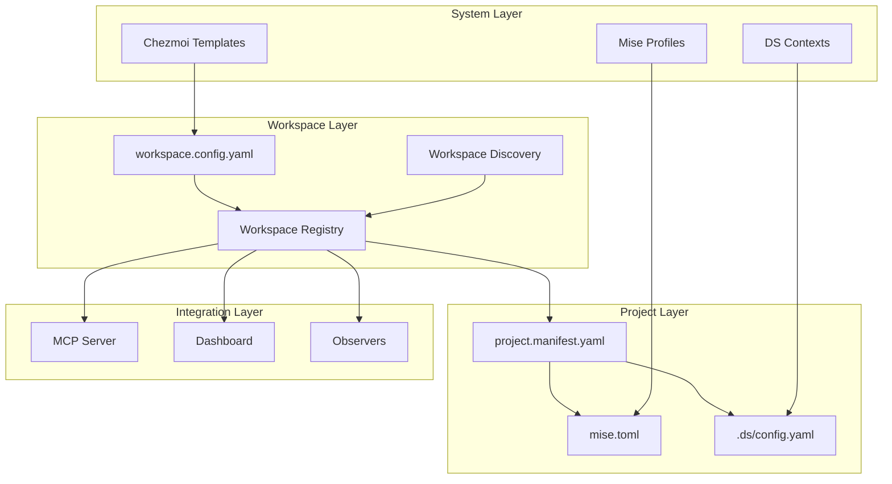

# Workspace Configuration Management Plan
**Version**: 2.0.0
**Created**: 2025-09-28
**Status**: Active Implementation
**Alignment**: Chezmoi + Mise + DS CLI + MCP + Dashboard

## Executive Summary

This plan establishes a comprehensive workspace configuration system that unifies project discovery, toolchain management, and observability across multiple development contexts. It follows September 2025 best practices for polyglot development environments with emphasis on reproducibility, security, and developer experience.

## Architecture Overview



## Core Concepts

### 1. Workspace Hierarchy

```yaml
# ~/.config/workspace/config.yaml
apiVersion: workspace.v2
kind: WorkspaceConfig

workspaces:
  personal:
    root: ~/Development/personal
    profile: personal
    github: verlyn13
    tier: production

  work:
    root: ~/Development/work
    profile: work
    github: jjohnson-47
    tier: production

  business:
    root: ~/Development/business
    profile: business
    github: happy-patterns
    tier: production

  experimental:
    root: ~/workspace/experiments
    profile: sandbox
    tier: development

defaults:
  discoveryDepth: 3
  autoRegister: true
  validateManifests: true
  requireSigning: false
```

### 2. Workspace Schema

```typescript
// workspace.schema.ts
export interface WorkspaceConfig {
  apiVersion: 'workspace.v2';
  kind: 'WorkspaceConfig';

  workspaces: Record<string, Workspace>;
  defaults: WorkspaceDefaults;
  policies?: WorkspacePolicies;
  hooks?: WorkspaceHooks;
}

export interface Workspace {
  root: string;                    // Root directory path
  profile: string;                 // Mise/DS profile name
  github?: string;                 // GitHub account
  gitlab?: string;                 // GitLab account
  tier: 'production' | 'staging' | 'development' | 'archive';

  discovery?: {
    enabled: boolean;
    patterns?: string[];          // Glob patterns for discovery
    exclude?: string[];           // Exclusion patterns
    depth?: number;               // Max traversal depth
  };

  toolchains?: {
    mise?: MiseConfig;
    ds?: DSConfig;
    env?: Record<string, string>;
  };

  observability?: {
    observers: string[];          // Enabled observers
    schedule?: string;            // Cron expression
    slo?: SLOConfig;
  };

  security?: {
    secretsProvider: 'gopass' | 'vault' | '1password';
    keyringPath?: string;
    requireSigning?: boolean;
  };
}

export interface WorkspaceDefaults {
  discoveryDepth: number;
  autoRegister: boolean;
  validateManifests: boolean;
  requireSigning: boolean;
  toolVersions?: Record<string, string>;
}
```

## Implementation Phases

### Phase 1: Workspace Discovery & Registration

#### 1.1 Discovery Service
```bash
#!/bin/bash
# scripts/workspace-discover.sh

discover_workspaces() {
  local config_file="${1:-$HOME/.config/workspace/config.yaml}"
  local registry_file="$HOME/.local/share/workspace/registry.json"

  # Parse workspace config
  local workspaces=$(yq eval '.workspaces | keys | .[]' "$config_file")

  for workspace in $workspaces; do
    local root=$(yq eval ".workspaces.$workspace.root" "$config_file")
    local profile=$(yq eval ".workspaces.$workspace.profile" "$config_file")
    local tier=$(yq eval ".workspaces.$workspace.tier" "$config_file")

    # Expand path
    root="${root/#\~/$HOME}"

    # Discover projects in workspace
    discover_projects "$root" "$workspace" "$profile" "$tier"
  done

  # Save registry
  save_registry "$registry_file"
}
```

#### 1.2 Registration API
```typescript
// src/workspace/registry.ts
export class WorkspaceRegistry {
  private workspaces: Map<string, WorkspaceEntry> = new Map();
  private projects: Map<string, ProjectEntry> = new Map();

  async register(workspace: Workspace): Promise<void> {
    // Validate workspace configuration
    await this.validateWorkspace(workspace);

    // Scan for projects
    const projects = await this.scanProjects(workspace.root, {
      depth: workspace.discovery?.depth || 3,
      patterns: workspace.discovery?.patterns,
      exclude: workspace.discovery?.exclude
    });

    // Register workspace
    this.workspaces.set(workspace.profile, {
      ...workspace,
      projectCount: projects.length,
      lastScanned: new Date().toISOString()
    });

    // Register projects
    for (const project of projects) {
      this.projects.set(project.id, {
        ...project,
        workspace: workspace.profile,
        tier: workspace.tier
      });
    }

    // Emit registration event
    this.emit('workspace:registered', workspace);
  }

  async discover(): Promise<DiscoveryResult> {
    const config = await this.loadConfig();
    const results: DiscoveryResult = {
      workspaces: [],
      projects: [],
      errors: []
    };

    for (const [name, workspace] of Object.entries(config.workspaces)) {
      try {
        await this.register(workspace);
        results.workspaces.push(name);
      } catch (error) {
        results.errors.push({
          workspace: name,
          error: error.message
        });
      }
    }

    return results;
  }
}
```

### Phase 2: Chezmoi Integration

#### 2.1 Workspace Template
```bash
# ~/.local/share/chezmoi/dot_config/workspace/config.yaml.tmpl
apiVersion: workspace.v2
kind: WorkspaceConfig

workspaces:
{{- range .workspaces }}
  {{ .name }}:
    root: {{ .root }}
    profile: {{ .profile }}
    {{- if .github }}
    github: {{ .github }}
    {{- end }}
    tier: {{ .tier | default "development" }}
    discovery:
      enabled: {{ .discovery.enabled | default true }}
      depth: {{ .discovery.depth | default 3 }}
    toolchains:
      mise:
        profiles:
          - {{ .profile }}
        autoInstall: {{ .mise.autoInstall | default true }}
      ds:
        context: {{ .name }}
        autoConnect: {{ .ds.autoConnect | default false }}
{{- end }}

defaults:
  discoveryDepth: {{ .workspace_defaults.discoveryDepth | default 3 }}
  autoRegister: {{ .workspace_defaults.autoRegister | default true }}
  validateManifests: {{ .workspace_defaults.validateManifests | default true }}
  requireSigning: {{ .workspace_defaults.requireSigning | default false }}

policies:
  maxProjectsPerWorkspace: {{ .policies.maxProjects | default 100 }}
  requireManifest: {{ .policies.requireManifest | default false }}
  allowedTiers:
    - production
    - staging
    - development
  toolchains:
    required:
      - git
      - mise
    optional:
      - docker
      - ds
```

#### 2.2 Chezmoi Data Configuration
```toml
# ~/.config/chezmoi/chezmoi.toml
[data]
workspaces = [
  { name = "personal", root = "~/Development/personal", profile = "personal", github = "verlyn13", tier = "production" },
  { name = "work", root = "~/Development/work", profile = "work", github = "jjohnson-47", tier = "production" },
  { name = "business", root = "~/Development/business", profile = "business", github = "happy-patterns", tier = "production" },
  { name = "experimental", root = "~/workspace/experiments", profile = "sandbox", tier = "development" }
]

[data.workspace_defaults]
discoveryDepth = 3
autoRegister = true
validateManifests = true
requireSigning = false

[data.policies]
maxProjects = 100
requireManifest = false
```

### Phase 3: Mise Workspace Profiles

#### 3.1 Global Mise Configuration
```toml
# ~/.config/mise/config.toml
[profiles.personal]
node = "24"
python = "3.13"
rust = "stable"
env = { WORKSPACE_PROFILE = "personal" }

[profiles.work]
node = "22"  # Work uses LTS
python = "3.11"
java = "17"
env = { WORKSPACE_PROFILE = "work", JAVA_HOME = "$MISE_JAVA_HOME" }

[profiles.business]
node = "24"
python = "3.13"
go = "1.25"
env = { WORKSPACE_PROFILE = "business" }

[profiles.sandbox]
node = "latest"
python = "latest"
rust = "nightly"
env = { WORKSPACE_PROFILE = "sandbox", EXPERIMENTAL = "true" }

# Workspace-aware task routing
[tasks.workspace:init]
run = """
workspace=$(pwd | sed -E 's#.*/Development/([^/]+).*#\\1#')
mise use --profile $workspace
echo "Initialized workspace: $workspace"
"""

[tasks.workspace:sync]
run = """
./scripts/workspace-discover.sh
./scripts/workspace-validate.sh
"""
```

#### 3.2 Per-Workspace Tool Versions
```bash
#!/bin/bash
# scripts/workspace-setup.sh

setup_workspace() {
  local workspace="${1:?Workspace name required}"
  local root=$(yq eval ".workspaces.$workspace.root" ~/.config/workspace/config.yaml)

  # Expand home directory
  root="${root/#\~/$HOME}"

  # Create workspace mise config
  cat > "$root/.mise.toml" <<EOF
# Workspace: $workspace
# Generated: $(date -Iseconds)

[env]
WORKSPACE = "$workspace"
WORKSPACE_ROOT = "$root"

[tools]
# Inherited from profile: $workspace
# Override specific versions here if needed

[tasks.build]
run = "mise run --profile $workspace build"

[tasks.test]
run = "mise run --profile $workspace test"
EOF

  echo "✅ Workspace $workspace configured at $root"
}
```

### Phase 4: DS CLI Context Management

#### 4.1 DS Context Configuration
```yaml
# ~/.config/ds/contexts.yaml
apiVersion: ds.v1
kind: ContextConfig

contexts:
  personal:
    server: http://127.0.0.1:7777
    workspace: ~/Development/personal
    auth:
      type: token
      tokenRef: gopass://personal/ds-token
    features:
      - code-analysis
      - observability
      - automation

  work:
    server: http://127.0.0.1:7778  # Different port for isolation
    workspace: ~/Development/work
    auth:
      type: oauth
      provider: corporate-sso
    features:
      - code-analysis
      - compliance
      - security-scanning

  business:
    server: http://127.0.0.1:7779
    workspace: ~/Development/business
    features:
      - code-analysis
      - deployment

currentContext: personal
```

#### 4.2 DS Workspace Integration
```bash
#!/bin/bash
# scripts/ds-workspace.sh

# Switch DS context based on current directory
ds_auto_context() {
  local current_dir=$(pwd)
  local workspace=""

  if [[ "$current_dir" == "$HOME/Development/personal"* ]]; then
    workspace="personal"
  elif [[ "$current_dir" == "$HOME/Development/work"* ]]; then
    workspace="work"
  elif [[ "$current_dir" == "$HOME/Development/business"* ]]; then
    workspace="business"
  else
    workspace="default"
  fi

  # Switch context if different
  local current_context=$(ds config get-context)
  if [[ "$current_context" != "$workspace" ]]; then
    ds config use-context "$workspace"
    echo "DS context switched to: $workspace"
  fi
}

# Hook into directory changes (Fish shell)
function __ds_context_switch --on-variable PWD
  ds_auto_context
end
```

### Phase 5: MCP Server Integration

#### 5.1 Workspace Resources
```typescript
// src/resources/workspace.resources.ts
export const workspaceResources = {
  'devops://workspace/registry': {
    async read(): Promise<WorkspaceRegistry> {
      const registry = await loadWorkspaceRegistry();
      return {
        workspaces: registry.workspaces,
        projects: registry.projects,
        stats: {
          totalWorkspaces: registry.workspaces.size,
          totalProjects: registry.projects.size,
          byTier: groupBy(registry.projects, 'tier'),
          byWorkspace: groupBy(registry.projects, 'workspace')
        }
      };
    }
  },

  'devops://workspace/{name}/projects': {
    async read(name: string): Promise<ProjectList> {
      const registry = await loadWorkspaceRegistry();
      const projects = Array.from(registry.projects.values())
        .filter(p => p.workspace === name);

      return {
        workspace: name,
        projects,
        count: projects.length
      };
    }
  },

  'devops://workspace/{name}/config': {
    async read(name: string): Promise<WorkspaceConfig> {
      const config = await loadWorkspaceConfig();
      const workspace = config.workspaces[name];

      if (!workspace) {
        throw new Error(`Workspace not found: ${name}`);
      }

      return workspace;
    }
  }
};
```

#### 5.2 Workspace Tools
```typescript
// src/tools/workspace.tools.ts
export const workspaceTools = {
  workspace_discover: {
    schema: z.object({
      workspaces: z.array(z.string()).optional(),
      force: z.boolean().default(false)
    }),

    async execute(params): Promise<DiscoveryResult> {
      const registry = new WorkspaceRegistry();
      const result = await registry.discover();

      // Update MCP server configuration
      await updateServerConfig({
        workspaces: result.workspaces,
        projectRoots: result.workspaces.map(w => w.root)
      });

      return {
        discovered: result.workspaces.length,
        projects: result.projects.length,
        errors: result.errors
      };
    }
  },

  workspace_init: {
    schema: z.object({
      name: z.string(),
      root: z.string(),
      profile: z.string(),
      tier: z.enum(['production', 'staging', 'development'])
    }),

    async execute(params): Promise<WorkspaceInitResult> {
      // Create workspace directory
      await fs.mkdir(params.root, { recursive: true });

      // Initialize git if needed
      if (!await exists(path.join(params.root, '.git'))) {
        await exec('git init', { cwd: params.root });
      }

      // Create workspace manifest
      const manifest = {
        apiVersion: 'workspace.v2',
        workspace: {
          name: params.name,
          profile: params.profile,
          tier: params.tier
        }
      };

      await fs.writeFile(
        path.join(params.root, 'workspace.yaml'),
        yaml.stringify(manifest)
      );

      // Setup mise profile
      await exec(`mise use --profile ${params.profile}`, { cwd: params.root });

      // Register with DS
      await exec(`ds config add-context ${params.name} --workspace ${params.root}`);

      return {
        workspace: params.name,
        path: params.root,
        initialized: true
      };
    }
  }
};
```

### Phase 6: Dashboard Integration

#### 6.1 Workspace API Endpoints
```typescript
// src/http/workspace-api.ts
export class WorkspaceAPI {
  // GET /api/workspaces
  async listWorkspaces(req, res) {
    const registry = await loadWorkspaceRegistry();

    res.json({
      workspaces: Array.from(registry.workspaces.values()).map(w => ({
        name: w.profile,
        root: w.root,
        tier: w.tier,
        projectCount: w.projectCount,
        health: await this.calculateWorkspaceHealth(w),
        lastScanned: w.lastScanned
      }))
    });
  }

  // GET /api/workspaces/:name
  async getWorkspace(req, res) {
    const { name } = req.params;
    const registry = await loadWorkspaceRegistry();
    const workspace = registry.workspaces.get(name);

    if (!workspace) {
      return res.status(404).json({ error: 'Workspace not found' });
    }

    const projects = await this.getWorkspaceProjects(name);
    const health = await this.calculateWorkspaceHealth(workspace);

    res.json({
      ...workspace,
      projects,
      health,
      metrics: {
        avgBuildTime: await this.getAvgBuildTime(name),
        depCompliance: await this.getDepCompliance(name),
        sloStatus: await this.getSLOStatus(name)
      }
    });
  }

  // GET /api/workspaces/:name/projects
  async getWorkspaceProjects(req, res) {
    const { name } = req.params;
    const { limit = 100, offset = 0, filter } = req.query;

    const projects = await queryWorkspaceProjects(name, {
      limit,
      offset,
      filter
    });

    res.json({
      workspace: name,
      projects,
      pagination: {
        limit,
        offset,
        total: projects.total,
        hasMore: offset + limit < projects.total
      }
    });
  }
}
```

#### 6.2 Dashboard Configuration
```json
{
  "dashboard": {
    "workspaces": {
      "enabled": true,
      "defaultView": "grid",
      "columns": [
        "name",
        "tier",
        "projectCount",
        "health",
        "lastActivity"
      ],
      "filters": {
        "tier": ["production", "staging", "development"],
        "health": ["healthy", "warning", "critical"]
      },
      "actions": [
        "discover",
        "sync",
        "archive"
      ]
    },
    "projects": {
      "groupBy": "workspace",
      "showWorkspaceBadge": true,
      "inheritWorkspaceConfig": true
    }
  }
}
```

### Phase 7: Validation & Health Checks

#### 7.1 Workspace Validator
```bash
#!/bin/bash
# scripts/workspace-validate.sh

validate_workspace() {
  local workspace="${1:?Workspace name required}"
  local config=$(yq eval ".workspaces.$workspace" ~/.config/workspace/config.yaml)

  local errors=()
  local warnings=()

  # Check root directory exists
  local root=$(echo "$config" | yq eval '.root' -)
  root="${root/#\~/$HOME}"

  if [[ ! -d "$root" ]]; then
    errors+=("Root directory does not exist: $root")
  fi

  # Check mise profile exists
  local profile=$(echo "$config" | yq eval '.profile' -)
  if ! mise list-profiles | grep -q "^$profile$"; then
    errors+=("Mise profile not found: $profile")
  fi

  # Check DS context exists
  if command -v ds &>/dev/null; then
    if ! ds config get-contexts | grep -q "^$profile$"; then
      warnings+=("DS context not configured: $profile")
    fi
  fi

  # Check project manifests
  if [[ -d "$root" ]]; then
    local manifest_count=$(find "$root" -maxdepth 3 -name "project.manifest.yaml" | wc -l)
    if [[ $manifest_count -eq 0 ]]; then
      warnings+=("No project manifests found in workspace")
    fi
  fi

  # Output validation result
  cat <<EOF
{
  "workspace": "$workspace",
  "valid": $([ ${#errors[@]} -eq 0 ] && echo "true" || echo "false"),
  "errors": $(printf '%s\n' "${errors[@]}" | jq -R . | jq -s .),
  "warnings": $(printf '%s\n' "${warnings[@]}" | jq -R . | jq -s .),
  "stats": {
    "projects": $manifest_count,
    "profile": "$profile",
    "tier": "$(echo "$config" | yq eval '.tier' -)"
  }
}
EOF
}

# Validate all workspaces
validate_all() {
  local workspaces=$(yq eval '.workspaces | keys | .[]' ~/.config/workspace/config.yaml)
  local results=[]

  for workspace in $workspaces; do
    results+=($(validate_workspace "$workspace"))
  done

  echo "${results[@]}" | jq -s '.'
}
```

#### 7.2 Health Monitoring
```typescript
// src/workspace/health.ts
export class WorkspaceHealth {
  async check(workspace: string): Promise<HealthStatus> {
    const checks = await Promise.all([
      this.checkDirectoryAccess(workspace),
      this.checkGitStatus(workspace),
      this.checkToolVersions(workspace),
      this.checkProjectManifests(workspace),
      this.checkObservability(workspace),
      this.checkSecurity(workspace)
    ]);

    const score = this.calculateScore(checks);
    const status = this.determineStatus(score);

    return {
      workspace,
      score,
      status,
      checks,
      timestamp: new Date().toISOString()
    };
  }

  private calculateScore(checks: Check[]): number {
    const weights = {
      directory: 20,
      git: 15,
      tools: 20,
      manifests: 15,
      observability: 15,
      security: 15
    };

    let totalScore = 0;
    for (const check of checks) {
      if (check.status === 'pass') {
        totalScore += weights[check.name] || 0;
      } else if (check.status === 'warning') {
        totalScore += (weights[check.name] || 0) * 0.5;
      }
    }

    return totalScore;
  }
}
```

## Configuration Files Summary

### Required Files
```
~/.config/
├── workspace/
│   └── config.yaml          # Main workspace configuration
├── chezmoi/
│   └── chezmoi.toml        # Workspace data for templates
├── mise/
│   └── config.toml         # Workspace profiles
└── ds/
    └── contexts.yaml       # DS workspace contexts

~/.local/share/
├── workspace/
│   ├── registry.json       # Discovered workspaces/projects
│   └── cache/              # Workspace metadata cache
└── chezmoi/
    └── dot_config/
        └── workspace/
            └── config.yaml.tmpl  # Workspace template
```

## Migration Path

### From Current State
```bash
#!/bin/bash
# scripts/migrate-to-workspaces.sh

# 1. Backup current configuration
cp -r ~/.config ~/.config.backup.$(date +%Y%m%d)

# 2. Generate workspace config from existing structure
cat > ~/.config/workspace/config.yaml <<EOF
apiVersion: workspace.v2
kind: WorkspaceConfig

workspaces:
  personal:
    root: ~/Development/personal
    profile: personal
    github: verlyn13
    tier: production

  work:
    root: ~/Development/work
    profile: work
    github: jjohnson-47
    tier: production

defaults:
  discoveryDepth: 3
  autoRegister: true
  validateManifests: true
EOF

# 3. Run discovery
./scripts/workspace-discover.sh

# 4. Validate
./scripts/workspace-validate.sh

# 5. Update MCP server config
./scripts/update-mcp-workspaces.sh
```

## Best Practices (September 2025)

### 1. Security
- Workspace isolation via profiles
- Per-workspace secret namespaces
- Signed commits per workspace
- Audit logging per workspace

### 2. Performance
- Lazy workspace loading
- Cached project discovery
- Incremental updates
- Parallel validation

### 3. Developer Experience
- Auto-context switching
- Workspace templates
- Quick workspace init
- Clear workspace boundaries

### 4. Observability
- Per-workspace metrics
- Workspace health scores
- SLO tracking by tier
- Cost attribution by workspace

## Success Metrics

- **Discovery Time**: < 5s for full scan
- **Context Switch**: < 100ms
- **Validation**: < 2s per workspace
- **Cache Hit Rate**: > 90%
- **Project Registration**: 100% coverage

## Next Steps

1. **Immediate**:
   - Create workspace config from existing Development structure
   - Run discovery to populate registry
   - Configure MCP server with workspace roots

2. **This Week**:
   - Setup mise workspace profiles
   - Configure DS contexts
   - Add workspace validation to CI

3. **Next Sprint**:
   - Dashboard workspace view
   - Workspace health monitoring
   - Cost tracking integration

This comprehensive plan provides a production-ready workspace configuration system that seamlessly integrates with your existing toolchain while following 2025 best practices for multi-context development environments.