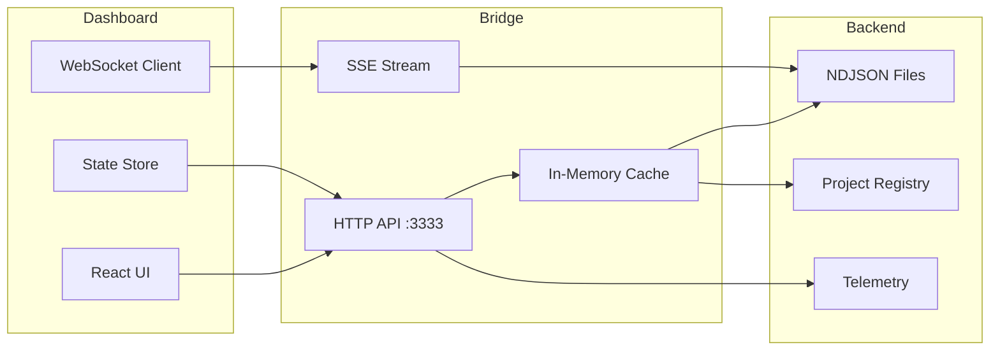

# Dashboard Integration Endpoints
**Version**: 1.0.0
**Updated**: 2025-09-28
**Purpose**: API reference for dashboard <-> observability bridge integration

## Overview

This document defines the HTTP endpoints exposed by the observability bridge for dashboard consumption. All endpoints are **read-only** and designed for local access (127.0.0.1:3333).

## Base Configuration

```yaml
base_url: http://127.0.0.1:3333
content_type: application/json
cache_control: public, max-age=60
cors: enabled (localhost only)
auth: none (local only)
```

## Core Endpoints

### 1. Telemetry Information
**GET** `/api/telemetry-info`

Returns configuration and metadata for telemetry integration.

```json
{
  "version": "1.0.0",
  "otlp": {
    "endpoint": "http://localhost:4317",
    "protocol": "grpc",
    "headers": {}
  },
  "prometheus": {
    "endpoint": "http://localhost:9090",
    "scrape_interval": "15s"
  },
  "loki": {
    "endpoint": "http://localhost:3100",
    "tenant": "default"
  },
  "tempo": {
    "endpoint": "http://localhost:4318",
    "trace_url_template": "http://localhost:3200/trace/{traceId}"
  },
  "cache_ttl": 300,
  "etag": "W/\"abc123\""
}
```

### 2. Project Inventory
**GET** `/api/projects`

Returns all discovered projects with current status.

```json
{
  "total": 12,
  "projects": [
    {
      "id": "github:personal/devops-mcp",
      "name": "devops-mcp",
      "tier": "prod",
      "kind": "app",
      "org": "personal",
      "health": {
        "status": "ok",
        "score": 95,
        "last_observation": "2025-09-28T18:00:00Z"
      },
      "summary": {
        "repo": "ok",
        "deps": "warn",
        "build": "ok",
        "slo_compliance": true
      }
    }
  ],
  "by_tier": {
    "prod": 3,
    "staging": 2,
    "dev": 7
  },
  "by_status": {
    "ok": 8,
    "warn": 3,
    "fail": 1
  }
}
```

### 3. Project Status (Paginated)
**GET** `/api/projects/:id/status?limit=100&cursor=<cursor>`

Returns observation history for a specific project.

```json
{
  "project_id": "github:personal/devops-mcp",
  "observations": [
    {
      "apiVersion": "obs.v1",
      "run_id": "550e8400-e29b-41d4-a716-446655440000",
      "timestamp": "2025-09-28T18:00:00Z",
      "observer": "repo",
      "status": "ok",
      "summary": "Branch: main, 0↑ 0↓, 0 dirty",
      "metrics": {
        "ahead": 0,
        "behind": 0,
        "dirty_files": 0,
        "latency_ms": 42
      }
    }
  ],
  "next_cursor": "550e8400-e29b-41d4-a716-446655440001",
  "has_more": true
}
```

### 4. Project Health
**GET** `/api/projects/:id/health`

Returns aggregated health metrics and SLO compliance.

```json
{
  "project_id": "github:personal/devops-mcp",
  "health_score": 95,
  "status": "ok",
  "slo": {
    "ciSuccessRate": {
      "target": ">=0.95",
      "current": 0.97,
      "compliant": true
    },
    "p95LocalBuildSec": {
      "target": "<=30",
      "current": 28,
      "compliant": true
    }
  },
  "observers": {
    "repo": {
      "status": "ok",
      "last_run": "2025-09-28T18:00:00Z"
    },
    "deps": {
      "status": "warn",
      "last_run": "2025-09-28T18:00:00Z",
      "issues": ["3 outdated packages"]
    }
  },
  "trends": {
    "7d": {
      "avg_health": 93,
      "slo_breaches": 1
    },
    "30d": {
      "avg_health": 91,
      "slo_breaches": 3
    }
  }
}
```

### 5. Event Stream (SSE)
**GET** `/api/events/stream`

Server-Sent Events stream for real-time updates.

```javascript
// Client connection
const eventSource = new EventSource('http://127.0.0.1:3333/api/events/stream');

eventSource.onmessage = (event) => {
  const data = JSON.parse(event.data);
  // Handle: ObserverCompleted, SLOBreach, ProjectDiscovered
};

// Event format
data: {"type":"ObserverCompleted","project_id":"...","observer":"repo","status":"ok"}

data: {"type":"SLOBreach","project_id":"...","slo":"ciSuccessRate","value":0.89}
```

### 6. Health Check
**GET** `/api/health`

System health and connectivity status.

```json
{
  "status": "healthy",
  "version": "1.0.0",
  "uptime": 3600,
  "checks": {
    "otlp": true,
    "registry": true,
    "filesystem": true
  },
  "metrics": {
    "projects_tracked": 12,
    "observations_today": 144,
    "events_emitted": 1024
  }
}
```

## DS CLI Discovery Endpoints

### 7. AI Discovery Manifest
**GET** `/.well-known/ai-discovery.json`

Returns AI tool discovery information for agents.

```json
{
  "version": "1.0",
  "name": "DevOps Observability Platform",
  "description": "Project observability and automation",
  "capabilities": [
    "project-discovery",
    "repository-analysis",
    "dependency-scanning",
    "slo-evaluation"
  ],
  "endpoints": {
    "projects": "/api/projects",
    "health": "/api/health"
  },
  "tools": {
    "ds": {
      "discovery": "http://127.0.0.1:7777/v1/capabilities",
      "docs": "http://127.0.0.1:7777/docs"
    }
  }
}
```

### 8. DS Server Integration

When DS server is running (`ds serve --addr 127.0.0.1:7777`):

```bash
# Discover capabilities
curl http://127.0.0.1:7777/v1/capabilities

# Get agent endpoints
curl http://127.0.0.1:7777/v1/agents

# Query specific agent
curl http://127.0.0.1:7777/v1/agents/code-analyzer
```

## Dashboard Integration Pattern

### Recommended Architecture



### Client Implementation Example

```typescript
// TypeScript client for dashboard
class ObservabilityClient {
  private baseUrl = 'http://127.0.0.1:3333';
  private eventSource: EventSource;

  async getProjects(): Promise<ProjectInventory> {
    const res = await fetch(`${this.baseUrl}/api/projects`);
    return res.json();
  }

  async getProjectHealth(id: string): Promise<ProjectHealth> {
    const res = await fetch(`${this.baseUrl}/api/projects/${id}/health`);
    return res.json();
  }

  subscribeToEvents(callback: (event: ObserverEvent) => void) {
    this.eventSource = new EventSource(`${this.baseUrl}/api/events/stream`);
    this.eventSource.onmessage = (e) => {
      callback(JSON.parse(e.data));
    };
  }

  disconnect() {
    this.eventSource?.close();
  }
}
```

## Error Responses

All endpoints return consistent error responses:

```json
{
  "error": {
    "code": "PROJECT_NOT_FOUND",
    "message": "Project not found: github:personal/unknown",
    "timestamp": "2025-09-28T18:00:00Z"
  }
}
```

Status codes:
- `200`: Success
- `404`: Resource not found
- `500`: Internal server error
- `503`: Service unavailable (backend not reachable)

## Caching Strategy

- Project inventory: 60s cache
- Project status: 30s cache
- Project health: 30s cache
- Telemetry info: 5m cache
- AI discovery: 1h cache

ETags provided for conditional requests.

## Security Considerations

1. **Local only**: Bridge binds to 127.0.0.1
2. **Read-only**: No mutation endpoints
3. **No secrets**: All sensitive data redacted
4. **Path validation**: File access restricted to allowed directories
5. **Rate limiting**: Built-in for expensive operations

## Performance Targets

- Project list: < 100ms
- Project status: < 200ms
- Health calculation: < 500ms
- SSE latency: < 50ms
- Cache hit ratio: > 80%

## Monitoring

Monitor these metrics in production:

```promql
# Request rate
rate(http_requests_total[5m])

# Latency p95
histogram_quantile(0.95, http_request_duration_seconds)

# Cache hit ratio
rate(cache_hits_total[5m]) / rate(cache_requests_total[5m])

# SSE connections
sse_connections_active

# Error rate
rate(http_requests_total{status=~"5.."}[5m])
```

## Version History

- **1.0.0** (2025-09-28): Initial version with core endpoints
- **1.1.0** (planned): Add GraphQL endpoint
- **1.2.0** (planned): Add WebSocket for bidirectional communication